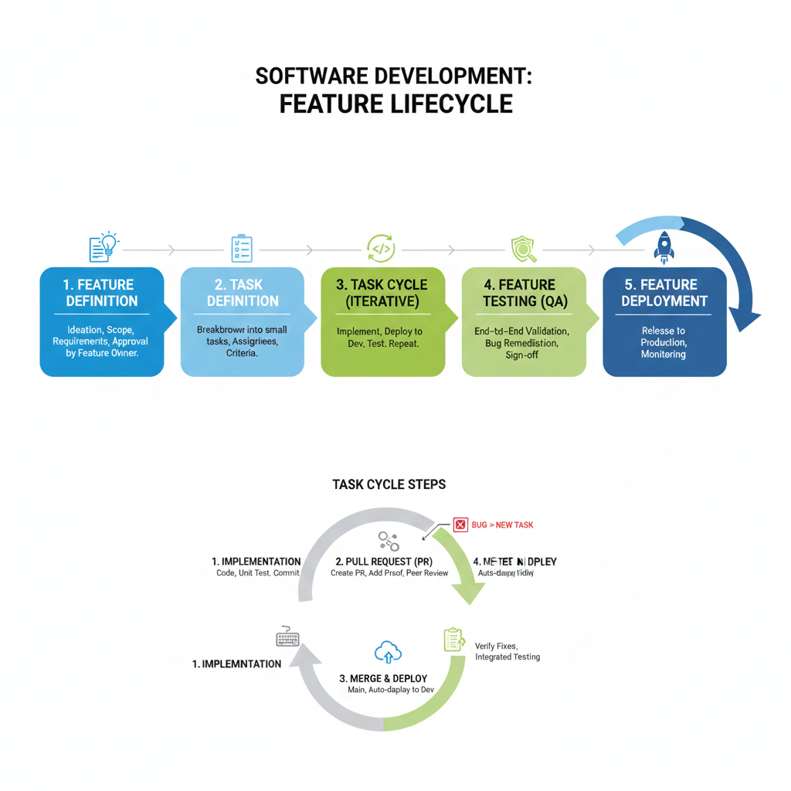

# Software Feature Development Cycle Overview

This document outlines the end-to-end feature-based development process using a Scrum-like methodology, focusing on structured definition, implementation, and deployment phases.

## Feature Lifecycle

The Feature Cycle is the top-level process that tracks a user-facing capability from conception to production release.

| Stage | Description |
| :--- | :--- |
| **Feature Definition** | Ideation, scope, and requirements are defined and approved. [more...](#feature-definition)|
| **Task Definition** | The feature is broken down into small, implementable development tasks. |
| **Task Cycle** | Tasks are implemented, deployed to a development environment, and tested. |
| **Feature Testing** | The completed feature is tested end-to-end in a quality assurance (QA) environment. |
| **Feature Deployment** | The feature is approved and deployed to the production environment. |

## Task Lifecycle

The Task Cycle is the iterative loop that developers follow to build, review, and integrate specific pieces of the feature.

| Stage | Description |
| :--- | :--- |
| **Task Definition** | Detailed plan for a single developer's work (e.g., build API endpoint). |
| **Task Implementation** | Coding, local testing, code review, and merging into the main branch. |
| **Task Deployment** | Automatic deployment to the Dev/Integration environment upon merge. |
| **Task Testing** | Re-testing the deployed code in QA (as part of a pre-release). |
